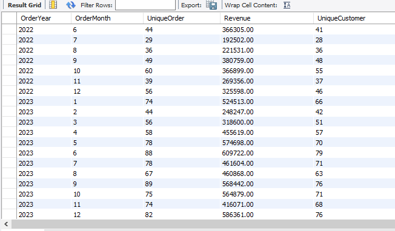
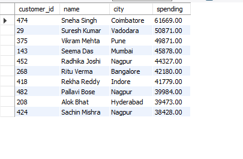
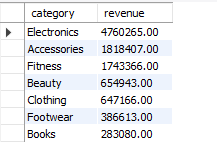
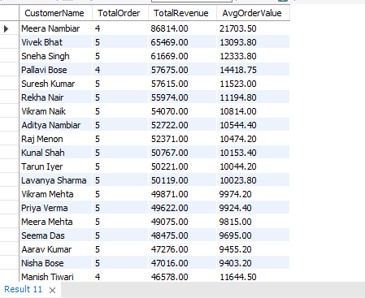
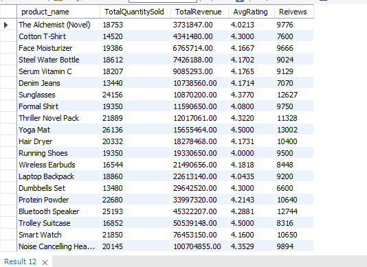

# E-Commerce SQL Analysis Project

## Project Overview

This project analyzes an e-commerce database using SQL to generate business insights related to customer behavior, product performance, category performance, and sales trends.

## Database Tables

* Customers
* Orders
* Order Items
* Products
* Reviews

## SQL Skills Used

* WHERE
* GROUP BY
* HAVING
* Aggregate Functions (SUM, AVG, COUNT)
* INNER JOIN
* LEFT JOIN
* Revenue Analysis
* Business Reporting

## Business Questions Solved

1. Revenue earned from each product category
2. Total revenue generated by each customer
3. Customers who never placed an order
4. Average product rating by category
5. Monthly revenue trend
6. Customers who purchased products but never reviewed them
7. Top 10 highest spending customers
8. Products generating high revenue but low ratings
9. Monthly sales report
10. Customer performance report
11. Product performance report
12. Category performance report
13. Customer engagement report

## Reports

### Monthly Sales Report

### Top 10 Highest Spending Customers

### Revenue by Product Category

### Customer Performance Report

### Product Performance Report

## Project Files

* e_commers_dataset.sql
* analysis_queries.sql
* README.md

